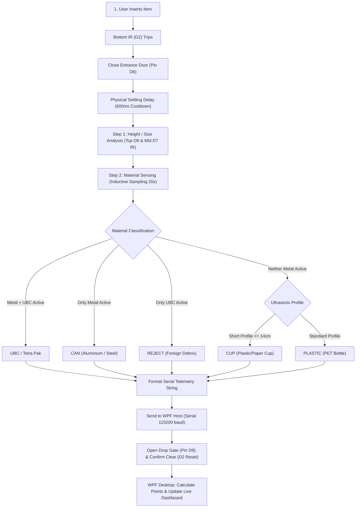
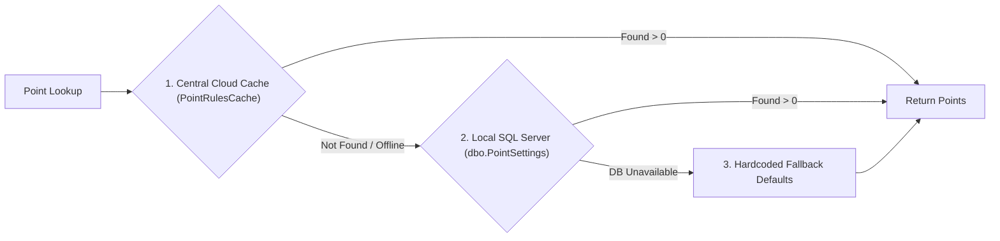

# RVM Material Detection and Reward Engine Documentation
*Reverse Vending Machine (RVM) – Dual-Screen Kiosk System*

This document provides a comprehensive, end-to-end technical breakdown of how items (bottles, cans, cartons, and cups) are detected, sized, classified, and rewarded across the hardware sensor firmware, WPF desktop software, and cloud/database layers.

---

## 1. Hardware Sensor Array & Pinout Mapping

The RVM uses an **Arduino Uno** running high-stability firmware (`RVM_Arduino.ino`) connected via USB Serial (`115200 baud`) to the Windows Kiosk PC.

| Component | Sensor Model / Type | Arduino Pin | Function |
| :--- | :--- | :--- | :--- |
| **Bottom IR Sensor** | E3F-DS10C4 NPN Photoelectric IR | `Pin D2` | Detects item arrival at the bottom inspection chamber; initiates sizing. |
| **Middle IR Sensor** | E3F-DS10C4 NPN Photoelectric IR | `Pin D7` | Intermediate height threshold (~15 cm); distinguishes Small vs Medium. |
| **Top IR Sensor** | E3F-DS10C4 NPN Photoelectric IR | `Pin D8` | Tall container threshold (~25 cm); identifies Large containers. |
| **Ultrasonic Sensor** | HC-SR04 (Trig / Echo) | `Pin D4` (Trig)<br>`Pin D3` (Echo) | Measures container displacement, empty chamber baseline, and height profile. |
| **Solid Metal Sensor** | NPN Inductive Proximity Sensor | `Pin D5` | Calibrated for solid conductive metals (aluminum and steel beverage cans). |
| **UBC / Tetra Sensor** | High-Sensitivity Inductive Sensor | `Pin D10` | Tuned to detect thin composite aluminum barrier foils in cartons. |
| **Bin Full Sensor** | NPN Optical / Proximity Sensor | `Pin D11` | Monitors storage bin capacity; halts intake if bin is full. |
| **Entrance Safety Door** | HC-SR04 & Micro Servo | `Pin D12` (Trig)<br>`Pin D13` (Echo)<br>`Pin D6` (Servo) | Hand protection & anti-cheat door; opens only when machine is ready. |
| **Main Trapdoor Servo** | High-Torque Servo | `Pin D9` | Drops accepted items into the bin (`Closed: 71°`, `Open: 199°`). |

---

## 2. Ingestion & Detection Lifecycle (Step-by-Step)



### Step 1: Ingestion & Settle Time
1. The user places a container into the chamber.
2. The **Bottom IR Sensor** (`irBottomPin D2`) trips.
3. The **Entrance Gate** closes immediately (`entranceClosedAngle = 75°`) to prevent double-insertions or foreign object tampering.
4. The machine pauses for **`600ms`** (`bottleSettleDelayMs`) to ensure the container comes to a **complete physical rest** against the bottom gate before taking measurements.

### Step 2: Size Detection (Static Optical Multi-Beam)
Size is determined by which photoelectric infrared beams are broken while the item is stationary:
- **`LARGE`**: Both `irMiddlePin` (`D7`) and `irTopPin` (`D8`) are blocked (Height $> 25\text{ cm}$, typically $> 1\text{L}$).
- **`MEDIUM`**: `irMiddlePin` (`D7`) is blocked, but `irTopPin` (`D8`) is clear (Height $15\text{ cm} - 25\text{ cm}$, typically $500\text{ml} - 1\text{L}$).
- **`SMALL`**: Neither `irMiddlePin` nor `irTopPin` is blocked; only `irBottomPin` is tripped (Height $< 15\text{ cm}$, typically $< 330\text{ml}$).

### Step 3: Material Sensing (Multi-Sample Inductive Filtering)
To avoid false positives from electrical noise or vibrating containers, the firmware samples both inductive sensors **20 times over a 200ms window** (requiring $\ge 15$ positive reads):
- **Both Metal + Tetra Active ($\ge 15$ samples)**:
  - Classified as **`TETRAPAK`** (Mapped to **`UBC`** - Used Beverage Carton). Cartons have internal aluminum barrier foil combined with paperboard.
- **Only Metal Active ($\ge 15$ samples)**:
  - Classified as **`CAN`** (Aluminum or tinplate beverage can).
- **Only Tetra Sensor Active**:
  - Classified as **`REJECT`** (Unrecognized metallic foil or non-standard composite).
- **Neither Sensor Active (Non-Metallic)**:
  - If height is short ($\le 14\text{ cm}$) and neither middle nor top IR is broken: classified as **`CUP`**.
  - Otherwise: classified as **`PLASTIC`** (PET beverage bottle).

### Step 4: Drop Confirmation & Anti-Jamming Safety
1. Arduino sends telemetry line:
   ```text
   SIZE:MEDIUM;MATERIAL:PLASTIC;METAL_SENSOR:0;TETRAPAK_SENSOR:0;METAL_COUNT:0;TETRAPAK_COUNT:0;SETTLED:1;DURATION:600;DISTANCE:24;CHANGE:12;EMPTY:36
   ```
2. Arduino opens the drop gate (`gateServo.write(199)`).
3. The container drops into the storage bin.
4. The **Bottom IR Sensor** must return to unblocked state within `1200ms` (`clearTimeoutMs`):
   - **If Cleared**: Arduino outputs `BOTTLE:CLEARED`. The WPF host commits points to the session.
   - **If Blocked**: Arduino outputs `ERROR:CLEAR_TIMEOUT`. Gate attempts clearing; no points are awarded until blockage is removed.

---

## 3. WPF Desktop Software Processing

When `SerialManager` receives the telemetry line, `MainWindow.xaml.cs` (and `LandscapeWindow.xaml.cs`) handles the data:

1. **State Validation**: Verifies `machineStarted == true` and `result.Material != "REJECT"`.
2. **Pending Stage**: Stores the detected item in `pendingBottleResult` and holds points in `pendingBottlePoints`.
3. **Commit on Drop**: Once `BOTTLE:CLEARED` arrives:
   - Increments material and size counters (`PlasticSmallCountText`, `CanMediumCountText`, etc.).
   - Adds points to `totalPoints` and `totalItems`.
   - Plays the dynamic green material acceptance video overlay (`AcceptedItemVideoWindow.ShowFor(this, result.Material)`).
   - Recalculates environmental impact metrics (CO₂ saved, energy conserved, landfill diverted).
   - Asynchronously synchronizes item details to the **Central Cloud API** (`CentralSyncService.SyncSessionToCentralDetailedAsync`).

---

## 4. Reward Rules & Points Engine

The reward engine uses a **3-tier cascading fallback system**:



### Standard Reward Points Matrix

| Material Type | Aliases Recognized | Size: SMALL | Size: MEDIUM | Size: LARGE | Unit Mode |
| :--- | :--- | :---: | :---: | :---: | :--- |
| **🧴 PLASTIC** | `PLASTIC`, `PET`, `BOTTLE` | **5 pts** | **10 pts** | **15 pts** | `per_piece` |
| **🥫 CAN** | `CAN`, `METAL`, `ALUMINIUM`, `ALU` | **10 pts** | **15 pts** | **20 pts** | `per_piece` |
| **🧃 UBC** | `UBC`, `TETRA`, `TETRAPAK`, `CARTON`, `PAPER` | **5 pts** | **10 pts** *(or 15/kg)* | **15 pts** | `per_piece` / `per_kg` |
| **🍾 GLASS** | `GLASS` | **10 pts** | **15 pts** | **20 pts** | `per_piece` |
| **🚫 REJECT** | `REJECT`, `UNKNOWN`, `NON_RECYCLABLE` | **0 pts** | **0 pts** | **0 pts** | N/A |

*Note: All values can be dynamically reconfigured from the Central Cloud Web Portal without restarting the kiosk.*

---

## 5. Environmental Impact Calculations

For every accepted item, the kiosk calculates real-time eco-impact:

$$\text{Landfill Diverted (kg)} = \text{Total Items} \times 0.035\text{ kg}$$

$$\text{CO}_2\text{ Reduction (kg)} = \text{Total Items} \times 0.082\text{ kg}$$

$$\text{Energy Conserved (Wh)} = \text{Total Items} \times 0.120\text{ kWh}$$

---

## 6. User Session Redemption & Wallet Crediting

At the end of a recycling session, the user can redeem their accumulated points via:

1. **Mobile Phone Number / Wallet**:
   - User enters their mobile number on the on-screen keypad.
   - The desktop app connects to the central cloud endpoint (`POST /api/kiosk/session/sync`) and local SQL Server (`dbo.Sessions` and `dbo.Transactions`).
   - Points are immediately credited to the user's mobile wallet balance.
2. **Printed QR / Voucher**:
   - For guest users who do not input a phone number, a receipt/voucher with session ID and barcode can be printed for manual store checkout redemption.
3. **Session Reset**:
   - Once credited, counters reset to 0 and the machine returns to the instruction standby loop.
