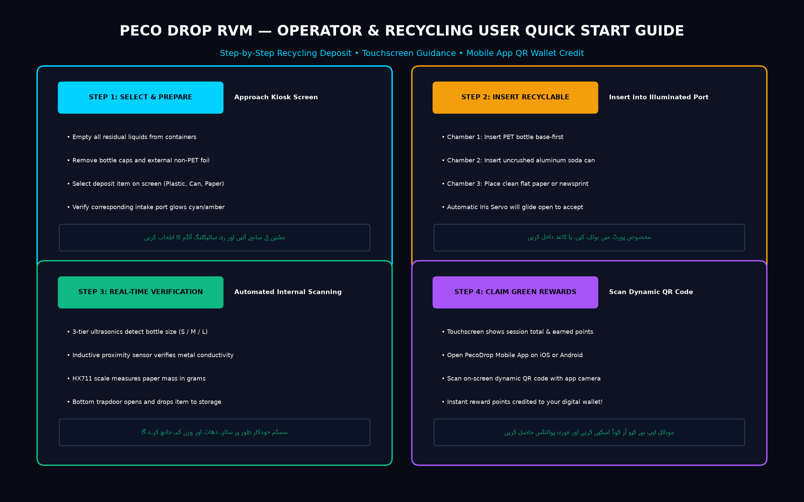
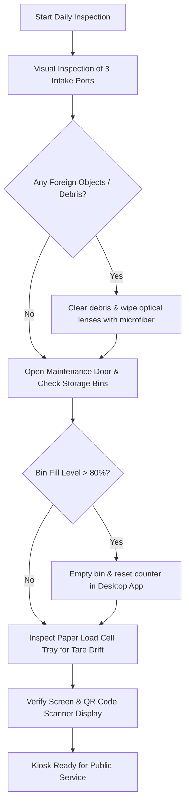

# PecoDrop Reverse Vending Machine (RVM) — Operator & Customer User Manual

> **Document Version:** 2.4.0 • **System Release:** 3-Chamber Smart Kiosk • **Model:** PecoDrop Pro Series  
> **Applicable Hardware:** Arduino Mega 2560 Multi-Chamber Controller • **Desktop Host:** PecoDropDesktopApp  

---

## 1. System Overview & Product Architecture

The **PecoDrop 3-Chamber Reverse Vending Machine (RVM)** is an automated electromechanical kiosk designed for high-throughput collection, automated sorting, volumetric sizing, material purity verification, and instant digital reward disbursement for consumer recyclables.

### Physical Dimensions & Enclosure Specifications
| Dimension Metric | Specification (Imperial) | Specification (Metric) | Engineering Notes |
| :--- | :--- | :--- | :--- |
| **Overall Width** | **48.0"** | 1,219 mm | Full front footprint width |
| **Overall Depth** | **24.0"** | 610 mm | Deep base for high-capacity internal bins |
| **Front Height** | **32.0"** | 813 mm | Ergonomic deposit reach height |
| **Rear Height** | **42.0"** | 1,067 mm | Full back panel height |
| **Front-to-Rear Rise** | **10.0"** | 254 mm | Sloped intake deck for natural item entry |
| **LED Area Height** | **~11.8"** | ~300 mm | Angled upper display console |
| **Dual Displays** | **2 × 24" Diagonal LED (16:9)** | 20.9" W × 11.8" H each | 2.0" display separation • 2.1" side frames |
| **Cabinet Facade** | Architectural Wood-Slat Panel | Acoustic & eco-aesthetic matte powder coat |

### Intake Port Geometries & Interactive Sub-Displays
* **Chamber 1 — Circular Aperture (`plastic`):** Illuminated cyan circular halo. Dedicated for PET plastic bottles (up to 2.5L) with dedicated "TO BOTTLES" dynamic status panel.
* **Chamber 2 — Triangular Aperture (`metal`):** Illuminated amber triangular halo. Dedicated for aluminum and steel beverage cans with "Waste less, recycle more." guidance display.
* **Chamber 3 — Square Aperture (`paper`):** Illuminated square aperture. Dedicated for clean paper, sheets, and cartons with integrated top-mounted high-speed optical QR code scanner.
* **Dual Upper 24" Consoles:** 
  * **Left Screen:** Curated sustainability campaigns, video advertisements, and multilingual operator guidance.
  * **Right Screen:** Live community recycling leaderboard displaying citizen rankings, points, and real-time environmental impact.

---

## 2. Customer Recycling Deposit Workflow

### Step-by-Step Deposit Instructions

#### Step 1: Approach & Material Selection
1. Stand in front of the PecoDrop kiosk. The intake ports are softly illuminated in standby mode.
2. Select your recyclable category on the touchscreen: **Plastic Bottles**, **Aluminum Cans**, or **Paper**.
3. **Urdu:** مشین کے سامنے آئیں اور اسکرین پر اپنی ری سائیکلنگ کیٹیگری کا انتخاب کریں۔

#### Step 2: Item Preparation & Insertion
1. Ensure containers are completely empty of liquid contents.
2. Remove caps or non-recyclable wraps.
3. Insert the container base-first into the corresponding glowing intake port:
   * **Chamber 1:** Plastic Bottles (Up to 2.5L).
   * **Chamber 2:** Aluminum Soda / Energy Drink Cans (Standard & Slim).
   * **Chamber 3:** Flat paper, newspapers, or office documents.
4. The automatic upper iris aperture gate will glide open to accept the item.
5. **Urdu:** مخصوص پورٹ میں بوتل، کین، یا کاغذ داخل کریں۔

#### Step 3: Automated Scanning & Internal Verification
1. Once accepted, the iris gate closes for user safety.
2. The internal scanning array activates:
   * **Plastic:** 3 vertical ultrasonic beams measure bottle height (Small, Medium, or Large).
   * **Can:** High-frequency inductive sensor checks metal conductivity (12 sample burst).
   * **Paper:** Load cell platform settles and weighs the deposit (grams converted to kg).
3. The bottom trapdoor rotates to discharge verified material into the internal bin.
4. **Urdu:** مشین خودکار طور پر سائز، دھات اور وزن کی تصدیق کر کے ذخیرہ کرے گی۔

#### Step 4: Claim Rewards via Dynamic QR Code
1. The screen displays your session summary (items deposited, verified weight, and green points).
2. Open the **PecoDrop Mobile App** on your smartphone.
3. Tap **Scan QR** and scan the dynamic barcode displayed on the kiosk screen.
4. Points are instantaneously credited to your account wallet!
5. **Urdu:** موبائل ایپ سے اسکرین پر موجود کیو آر کوڈ اسکین کریں اور فوری انعامات حاصل کریں۔

---

## 3. Accepted vs. Rejected Items Matrix

| Recycling Stream | Intake Port | Accepted Items | Strictly Rejected Items |
| :--- | :--- | :--- | :--- |
| **PET Plastic** | **Chamber 1 (Cyan)** | • Clear & tinted PET bottles (250ml to 2L+) • Water, soda, and sports beverage bottles • Clean containers | • Bottles filled with liquids • Crushed/flattened bottles (size error) • Glass bottles • PVC pipes, motor oil cans |
| **Beverage Cans** | **Chamber 2 (Amber)** | • Standard 330ml / 500ml aluminum cans • Slim 250ml energy drink cans • Tinplate food cans (empty) | • Severely flattened metal foil • Aerosol / pressurized cans • Plastic coated composites • Batteries |
| **Paper Waste** | **Chamber 3 (Emerald)** | • Clean white office paper & letters • Newspapers, magazines & flyers • Flattened cardboard packaging | • Wet or grease-soaked paper • Carbon paper & thermal receipts • Styrofoam & plastic bubble wrap • Metal clips & large binders |

---

## 4. Bilingual Operational Prompts (English & Urdu)

| System State | English Display Banner | Urdu Audio/Visual Guidance (اردو) |
| :--- | :--- | :--- |
| **Kiosk Ready** | *System Ready. Please insert plastic bottle, can, or paper.* | مشین تیار ہے • برائے مہربانی پلاسٹک کی بوتل، کین، یا کاغذ داخل کریں |
| **Item Accepted** | *Object Accepted. Scanning size & material purity...* | آئٹم قبول کر لیا گیا • سائز اور میٹریل کی جانچ جاری ہے |
| **Plastic Sized** | *Plastic Bottle verified: Medium Tier (+15 Points).* | پلاسٹک کی بوتل تصدیق شدہ: درمیانی سائز (+15 پوائنٹس) |
| **Metal Verified** | *Aluminum Can verified: 100% Metal (+20 Points).* | ایلومینیم کین کی تصدیق مکمل (+20 پوائنٹس) |
| **Paper Weighed** | *Paper mass logged: 0.185 kg (+25 Points).* | کاغذ کا وزن کامیابی سے ریکارڈ کیا گیا (+25 پوائنٹس) |
| **Session Finished**| *Session Complete! Scan dynamic QR code on screen.* | سیشن مکمل! اسکرین پر موجود کیو آر کوڈ اسکین کریں |
| **Error / Jam** | *Chamber intake blocked. Attendant alerted.* | چیمبر میں رکاوٹ • عملے کو مطلع کر دیا گیا ہے |

---

## 5. Attendant Daily Operational Checklist

Kiosk attendants and store operators should perform the following daily checks:

### Morning Opening Checklist
1. **Power Supply:** Ensure primary 12V 15A industrial power supply is energized and green LEDs are active.
2. **Servo Gate Verification:** Confirm all 3 iris gates and 3 bottom drop gates are closed in safe position (10°).
3. **Sensor Lens Cleanliness:** Wipe the ultrasonic sensor cones and inductive proximity sensor face with an antistatic, lint-free microfiber cloth.
4. **App Initialization:** Verify that the host PC running `PecoDropDesktopApp` has established serial connection with `RVM_Arduino` at **115200 baud**.
5. **Auto-Calibration Test:** Trigger `CALIBRATE` command from the attendant dashboard. Confirm `CALIBRATION:OK` and `MACHINE:IDLE` appear on status logs.

### Emergency Procedures
* **In case of object jam:** Press the **EMERGENCY STOP** button on the side panel, or send `STOP` via the management console. This immediately commands `makeSafe()` to disengage gate servos.
* **Liquid Spills:** Immediately de-energize the kiosk using the main safety breaker switch located on the bottom-right interior cabinet.
