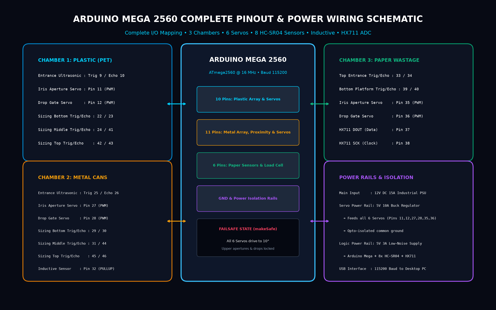
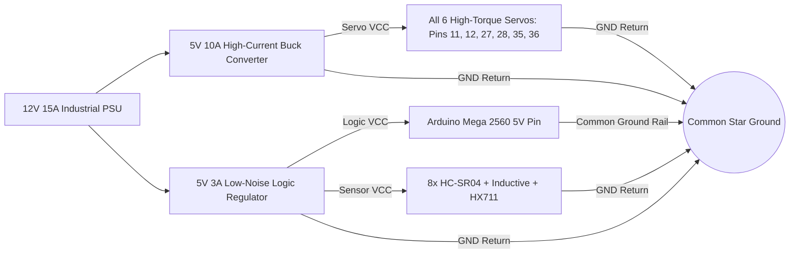
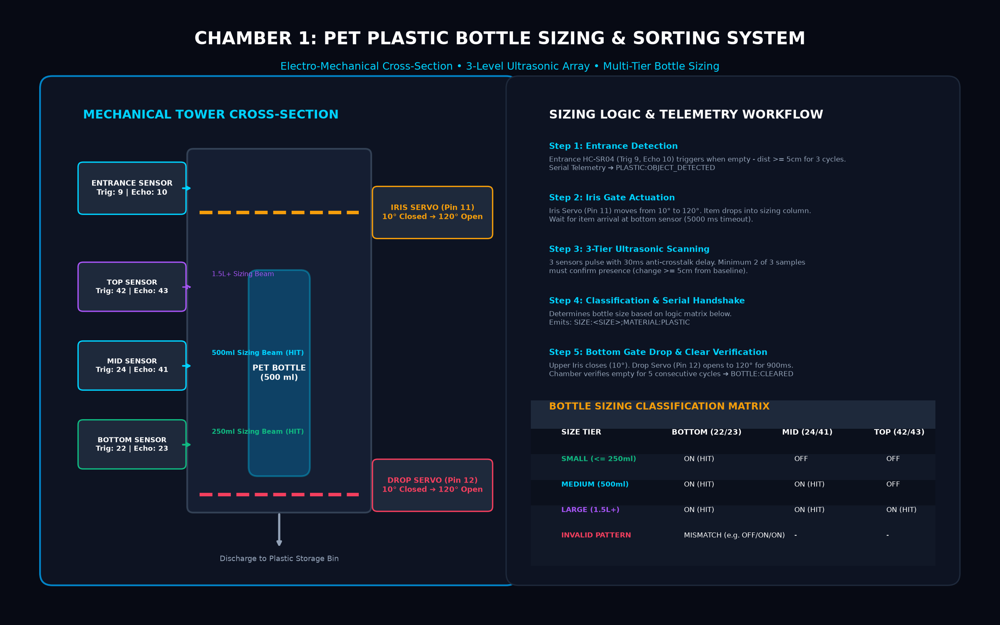
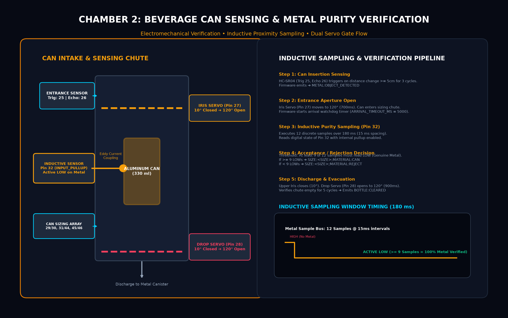
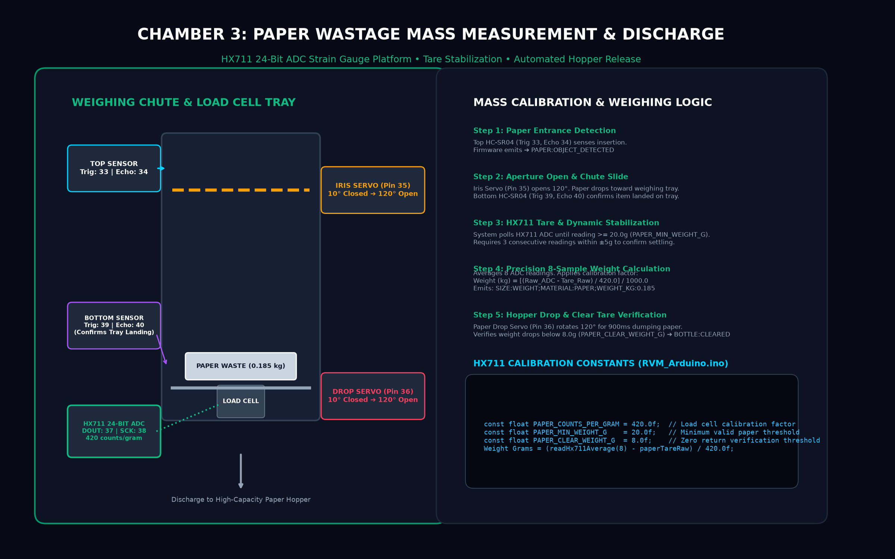

# PecoDrop Reverse Vending Machine (RVM) — Hardware Engineering & Assembly Manual

> **Target Audience:** Hardware Engineers, Mechatronics Fabricators, Robotics Technicians  
> **Firmware Reference:** `PecoDropDesktopApp/Arduino/RVM_Arduino/RVM_Arduino.ino`  
> **Controller Platform:** Atmel ATmega2560 (Arduino Mega 2560 Rev3) @ 16 MHz  

---

## 1. Master Pinout & Electrical Wiring Reference

The PecoDrop RVM relies on a centralized Arduino Mega 2560 controlling 6 servos, 8 HC-SR04 ultrasonic sensors, 1 high-frequency inductive proximity sensor, and 1 HX711 24-bit ADC load cell amplifier.



### Comprehensive Pin Allocation Table

| Chamber | Component Description | Hardware Interface | Arduino Pin | Logic / Signal | Electrical Characteristics |
| :--- | :--- | :--- | :--- | :--- | :--- |
| **Plastic** | Entrance HC-SR04 Trigger | Digital Output | **Pin 9** | 10µs Active HIGH Pulse | 5V TTL Logic |
| **Plastic** | Entrance HC-SR04 Echo | Digital Input | **Pin 10** | Pulse Width (58 µs/cm) | 5V TTL (20,000 µs Timeout) |
| **Plastic** | Upper Iris Aperture Servo | PWM Servo Output | **Pin 11** | 50 Hz PWM Duty Cycle | 10° Closed / 120° Open |
| **Plastic** | Bottom Drop Gate Servo | PWM Servo Output | **Pin 12** | 50 Hz PWM Duty Cycle | 10° Closed / 120° Open |
| **Plastic** | Sizing Array Bottom Sensor | Digital Trig / Echo | **Pins 22 / 23** | Trigger (Out) / Echo (In) | 5V TTL (Anti-crosstalk 30ms) |
| **Plastic** | Sizing Array Middle Sensor | Digital Trig / Echo | **Pins 24 / 41** | Trigger (Out) / Echo (In) | 5V TTL (Anti-crosstalk 30ms) |
| **Plastic** | Sizing Array Top Sensor | Digital Trig / Echo | **Pins 42 / 43** | Trigger (Out) / Echo (In) | 5V TTL (Anti-crosstalk 30ms) |
| **Metal** | Entrance HC-SR04 Trigger | Digital Output | **Pin 25** | 10µs Active HIGH Pulse | 5V TTL Logic |
| **Metal** | Entrance HC-SR04 Echo | Digital Input | **Pin 26** | Pulse Width (58 µs/cm) | 5V TTL (20,000 µs Timeout) |
| **Metal** | Upper Iris Aperture Servo | PWM Servo Output | **Pin 27** | 50 Hz PWM Duty Cycle | 10° Closed / 120° Open |
| **Metal** | Bottom Drop Gate Servo | PWM Servo Output | **Pin 28** | 50 Hz PWM Duty Cycle | 10° Closed / 120° Open |
| **Metal** | Sizing Array Bottom Sensor | Digital Trig / Echo | **Pins 29 / 30** | Trigger (Out) / Echo (In) | 5V TTL (Anti-crosstalk 30ms) |
| **Metal** | Sizing Array Middle Sensor | Digital Trig / Echo | **Pins 31 / 44** | Trigger (Out) / Echo (In) | 5V TTL (Anti-crosstalk 30ms) |
| **Metal** | Sizing Array Top Sensor | Digital Trig / Echo | **Pins 45 / 46** | Trigger (Out) / Echo (In) | 5V TTL (Anti-crosstalk 30ms) |
| **Metal** | Inductive Proximity Sensor | Digital Input | **Pin 32** | Active LOW on Metal | `INPUT_PULLUP` enabled |
| **Paper** | Top Entrance HC-SR04 | Digital Trig / Echo | **Pins 33 / 34** | Trigger (Out) / Echo (In) | 5V TTL Logic |
| **Paper** | Bottom Platform HC-SR04 | Digital Trig / Echo | **Pins 39 / 40** | Trigger (Out) / Echo (In) | 5V TTL (Arrival confirmation) |
| **Paper** | Upper Iris Aperture Servo | PWM Servo Output | **Pin 35** | 50 Hz PWM Duty Cycle | 10° Closed / 120° Open |
| **Paper** | Paper Drop Gate Servo | PWM Servo Output | **Pin 36** | 50 Hz PWM Duty Cycle | 10° Closed / 120° Open |
| **Paper** | HX711 Serial Data (DOUT) | Digital Input | **Pin 37** | 24-bit Serial Bitstream | Pull-up; Active LOW ready |
| **Paper** | HX711 Serial Clock (SCK) | Digital Output | **Pin 38** | Bit-banged 25 Clock Pulses | 5V TTL |

---

## 2. Power Supply & Ground Distribution Architecture



> [!CAUTION]
> **NEVER power the 6 servos directly from the Arduino Mega 5V pin.** Servos operating under mechanical load can draw peak surge currents up to 2.2A per motor. Doing so will trigger immediate brown-out resets on the ATmega2560. Maintain a dedicated 5V 10A buck converter for servo VCC and tie all grounds in a star topology.

---

## 3. Chamber 1 Engineering: PET Plastic Sizing Tower



### Mechanical Design & Assembly Parameters
* **Chute Internal Diameter:** 120 mm circular acrylic or low-friction PVC cylinder.
* **Vertical Ultrasonic Spacing:**
  * **Bottom Sensor (Pins 22/23):** Located 80 mm from bottom drop plate (detects small containers ≤ 250ml).
  * **Middle Sensor (Pins 24/41):** Located 190 mm from bottom drop plate (detects 500ml standard bottles).
  * **Top Sensor (Pins 42/43):** Located 310 mm from bottom drop plate (detects 1.5L to 2.5L large containers).
* **Entrance Trigger Condition:** Triggered when object distance drops $\ge 5\text{ cm}$ below empty pipe baseline for 3 consecutive poll cycles (`REQUIRED_DETECTIONS = 3`).
* **Sizing Classification Matrix:**

```
+-------------------------------------------------------------+
| Bottle Tier       | Bottom (22/23) | Mid (24/41) | Top (42/43)  |
+-------------------------------------------------------------+
| SMALL (<= 250ml)  |      ON        |     OFF     |     OFF      |
| MEDIUM (500ml)    |      ON        |     ON      |     OFF      |
| LARGE (1.5L+)     |      ON        |     ON      |     ON       |
| INVALID PATTERN   |  Any broken sequence (e.g. OFF / ON / ON)   |
+-------------------------------------------------------------+
```

---

## 4. Chamber 2 Engineering: Can Sensing & Inductive Purity



### Electromechanical Setup
* **Inductive Proximity Sensor Specification:** NPN Normally Open (NO), 12mm cylindrical threaded barrel, detection range 4mm to 8mm against non-ferrous aluminum.
* **Sensor Pin Configuration:** Connected to Arduino **Pin 32**. Configured as `pinMode(metal.materialSensorPin, INPUT_PULLUP)`.
* **Signal Inversion:** 
  * Unactivated state (No metal): `HIGH` (via internal pullup).
  * Metal proximity state: `LOW` (`METAL_DETECTED_STATE = LOW`).
* **Noise Immunity Algorithm:**
  ```cpp
  bool metalDetectedStable() {
    byte count = 0;
    for (byte i = 0; i < 12; i++) {
      if (digitalRead(metal.materialSensorPin) == METAL_DETECTED_STATE) count++;
      delay(15);
    }
    return count >= 9; // Must hold Active LOW for >= 75% of sampling window
  }
  ```

---

## 5. Chamber 3 Engineering: Paper Mass Load Cell Platform



### Precision Strain Gauge Platform & Calibration
* **Load Cell Rating:** 5 kg single-point parallel beam aluminum strain gauge (rated sensitivity $1.0 \pm 0.15\text{ mV/V}$).
* **ADC Converter:** Avia Semiconductor HX711 (24-bit precision ADC module configured for Channel A, gain 128).
* **Wiring Color Code:**
  * Red: Excitation+ (E+)
  * Black: Excitation- (E-)
  * White: Signal+ (A+)
  * Green: Signal- (A-)
* **Firmware Calibration Factors:**
  * `PAPER_COUNTS_PER_GRAM = 420.0f` (420 ADC raw counts per 1.0 gram).
  * `PAPER_MIN_WEIGHT_G = 20.0f` (Minimum valid paper deposit threshold).
  * `PAPER_CLEAR_WEIGHT_G = 8.0f` (Tare return threshold confirming chute is completely cleared).
* **Tare Stabilization Routine:**
  To eliminate mechanical vibration from the opening iris gate, the system requires 3 consecutive weight readings within $\pm 5.0\text{ g}$ before executing the final 8-sample mass calculation.
