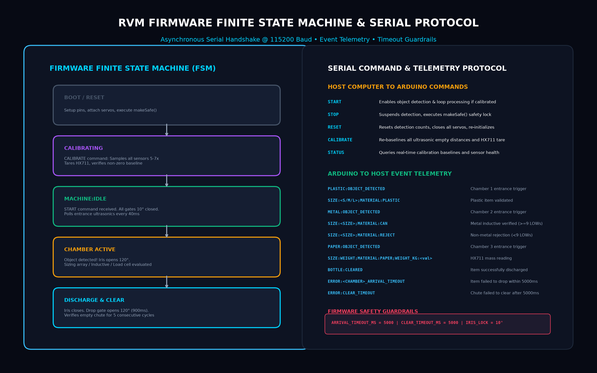
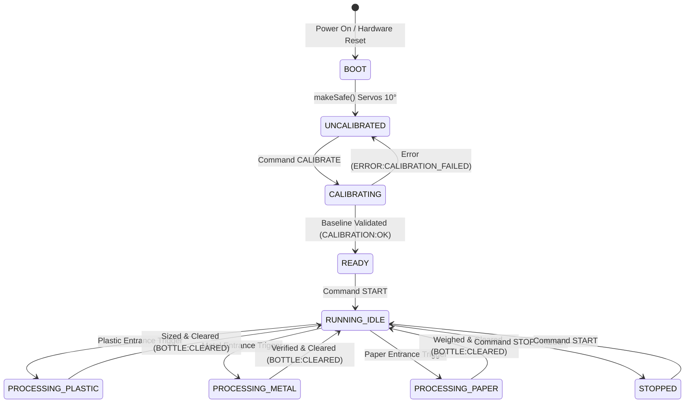

# PecoDrop Reverse Vending Machine (RVM) — Firmware Architecture & Serial API Manual

> **Document Type:** Developer & Software Integrator Reference  
> **Source Code:** `PecoDropDesktopApp/Arduino/RVM_Arduino/RVM_Arduino.ino`  
> **Interface:** Universal Asynchronous Receiver-Transmitter (UART / USB Serial)  
> **Baud Rate:** 115200 bps • 8 Data Bits • No Parity • 1 Stop Bit (8-N-1) • Line Terminator: `\n` or `\r\n`  

---

## 1. System State Machine & Serial Handshake

The Arduino Mega firmware acts as an autonomous real-time controller that exchanges high-level state events with the host PC (`PecoDropDesktopApp`).





---

## 2. Inbound Serial Command Dictionary (Host ➔ Arduino)

Commands sent from the desktop host application must be uppercase strings terminated with a newline (`\n`).

### `START`
* **Description:** Enables automatic object detection across all three chambers. Requires prior successful calibration.
* **Firmware Response:**
  * If calibrated: `MACHINE:STARTED\n` followed by `MACHINE:IDLE\n`
  * If uncalibrated: `ERROR:NOT_CALIBRATED\n`

### `STOP`
* **Description:** Immediately suspends object polling and commands all 6 servos to the locked 10° position via `makeSafe()`.
* **Firmware Response:** `MACHINE:STOPPED\n`

### `RESET`
* **Description:** Disables machine operation, resets detection counters to 0, and restores all servo angles to 10°.
* **Firmware Response:** `RESET:OK\n`

### `CALIBRATE`
* **Description:** Initiates full empty-baseline calibration across all 8 ultrasonic sensors and tares the HX711 paper load cell.
* **Firmware Response:**
  ```
  CALIBRATION:REMOVE_OBJECTS
  CALIBRATION:PLASTIC_EMPTY_CM:<val>
  CALIBRATION:PLASTIC_SIZE_BOTTOM_CM:<val>
  CALIBRATION:PLASTIC_SIZE_MIDDLE_CM:<val>
  CALIBRATION:PLASTIC_SIZE_TOP_CM:<val>
  CALIBRATION:METAL_EMPTY_CM:<val>
  CALIBRATION:METAL_SIZE_BOTTOM_CM:<val>
  CALIBRATION:METAL_SIZE_MIDDLE_CM:<val>
  CALIBRATION:METAL_SIZE_TOP_CM:<val>
  CALIBRATION:PAPER_TOP_EMPTY_CM:<val>
  CALIBRATION:PAPER_BOTTOM_EMPTY_CM:<val>
  CALIBRATION:PAPER_TARE_RAW:<val>
  CALIBRATION:OK
  MACHINE:STARTED
  MACHINE:IDLE
  ```

### `STATUS`
* **Description:** Queries real-time machine operating status, current empty baseline distances, metal sensor digital state, and paper scale health.
* **Firmware Response:** Single formatted telemetry line:
  ```
  STATUS:<RUNNING|READY|NOT_CALIBRATED>;PLASTIC_CM:<v>;PLASTIC_SIZE_CM:<b,m,t>;METAL_CM:<v>;METAL_SIZE_CM:<b,m,t>;PAPER_TOP_CM:<v>;PAPER_BOTTOM_CM:<v>;METAL_SENSOR:<DETECTED|CLEAR>;PAPER_SCALE:<READY|ERROR>
  ```

---

## 3. Outbound Telemetry Event Stream (Arduino ➔ Host)

| Telemetry String | Origin Chamber | Regex Parsing Pattern | Description |
| :--- | :--- | :--- | :--- |
| `RVM:PLASTIC_METAL_PAPER_READY` | System | `^RVM:PLASTIC_METAL_PAPER_READY$` | Emitted immediately after serial initialization at boot. |
| `PLASTIC:OBJECT_DETECTED` | Chamber 1 | `^PLASTIC:OBJECT_DETECTED$` | User inserted bottle at entrance; iris servo opening. |
| `PLASTIC:SIZING_START` | Chamber 1 | `^PLASTIC:SIZING_START$` | Bottle dropped into chute; ultrasonic array scanning. |
| `SIZE:<SIZE>;MATERIAL:PLASTIC` | Chamber 1 | `^SIZE:(SMALL\|MEDIUM\|LARGE);MATERIAL:PLASTIC$` | Sizing completed successfully. Emits tier size. |
| `METAL:OBJECT_DETECTED` | Chamber 2 | `^METAL:OBJECT_DETECTED$` | Can detected at entrance; iris servo opening. |
| `METAL:SIZING_START` | Chamber 2 | `^METAL:SIZING_START$` | Can dropped into chute; inductive verification active. |
| `SIZE:<SIZE>;MATERIAL:CAN` | Chamber 2 | `^SIZE:(SMALL\|MEDIUM\|LARGE);MATERIAL:CAN$` | 100% Genuine aluminum/steel can verified ($\ge 9$ LOWs). |
| `SIZE:<SIZE>;MATERIAL:REJECT` | Chamber 2 | `^SIZE:(.+);MATERIAL:REJECT$` | Non-metallic object rejected ($< 9$ LOWs). |
| `PAPER:OBJECT_DETECTED` | Chamber 3 | `^PAPER:OBJECT_DETECTED$` | Paper insertion sensed; iris servo opening. |
| `SIZE:WEIGHT;MATERIAL:PAPER;WEIGHT_KG:<val>` | Chamber 3 | `^SIZE:WEIGHT;MATERIAL:PAPER;WEIGHT_KG:([0-9\.]+)$` | Paper stabilized and weighed. Value in decimal kilograms. |
| `BOTTLE:CLEARED` | All Chambers | `^BOTTLE:CLEARED$` | Bottom drop gate opened and chute verified 100% empty. |

---

## 4. Error Code Dictionary & Recovery Logic

| Error Message | Failure Cause | Firmware Action Taken | Recommended Desktop Action |
| :--- | :--- | :--- | :--- |
| `ERROR:CALIBRATION_FAILED` | One or more sensors timed out or read 0cm during baseline calibration. | `machineRunning = false`; stays in safe mode. | Prompt technician to inspect sensor wiring and verify clear chutes. |
| `ERROR:PLASTIC_ARRIVAL_TIMEOUT` | Bottle stuck in upper iris or removed before reaching bottom sensor (5000ms). | Iris gate closes (10°); detection count reset to 0. | Show user retry prompt on touchscreen; log warning. |
| `ERROR:METAL_ARRIVAL_TIMEOUT` | Can failed to reach internal tray within 5000ms. | Iris gate closes (10°); detection count reset to 0. | Prompt user to verify can insertion; check mechanical flap. |
| `ERROR:PAPER_WEIGHT_TIMEOUT` | Paper mass failed to stabilize $\ge 20\text{ g}$ within 5000ms. | Iris gate closes (10°); detection count reset to 0. | Alert user that paper is below 20g threshold. |
| `ERROR:PLASTIC_INVALID_SENSOR_PATTERN` | Ultrasonic height array reported physically impossible pattern (e.g. Top hit, Bottom clear). | Iris gate closes (10°); rejects deposit. | Chute dirty or sensor obstructed; alert attendant. |
| `ERROR:CLEAR_TIMEOUT` | Drop gate opened, but sensor still reports object present after 5000ms. | Drop gate closes; emits error; resets detection. | Physical jam in lower hopper; trigger attendant alert. |
| `ERROR:PAPER_SCALE_NOT_READY` | HX711 DOUT pin held HIGH continuously (>1000ms). | Flag `paperScaleReady = false`. | Check HX711 VCC/GND and load cell wiring. |

---

## 5. Desktop Application Integration Code (C# / .NET)

Below is the production telemetry parsing implementation for desktop integration in C# (`CentralSyncService.cs`):

```csharp
public class RvmSerialProtocolHandler
{
    private SerialPort _port;

    public void OnDataReceived(object sender, SerialDataReceivedEventArgs e)
    {
        while (_port.IsOpen && _port.BytesToRead > 0)
        {
            string line = _port.ReadLine().Trim();
            ParseTelemetry(line);
        }
    }

    private void ParseTelemetry(string line)
    {
        if (line.StartsWith("SIZE:") && line.Contains(";MATERIAL:"))
        {
            var parts = line.Split(';');
            string sizeStr = parts[0].Replace("SIZE:", "");
            string materialStr = parts[1].Replace("MATERIAL:", "");

            if (materialStr == "PLASTIC") {
                RewardManager.AddPlasticReward(sizeStr);
            } else if (materialStr == "CAN") {
                RewardManager.AddCanReward(sizeStr);
            } else if (materialStr == "PAPER") {
                float weightKg = float.Parse(parts[2].Replace("WEIGHT_KG:", ""));
                RewardManager.AddPaperReward(weightKg);
            }
        }
        else if (line == "BOTTLE:CLEARED")
        {
            UiManager.ShowDepositSuccessAnimation();
        }
        else if (line.StartsWith("ERROR:"))
        {
            LogManager.LogError($"Hardware fault reported: {line}");
            UiManager.ShowJamWarning(line);
        }
    }
}
```
