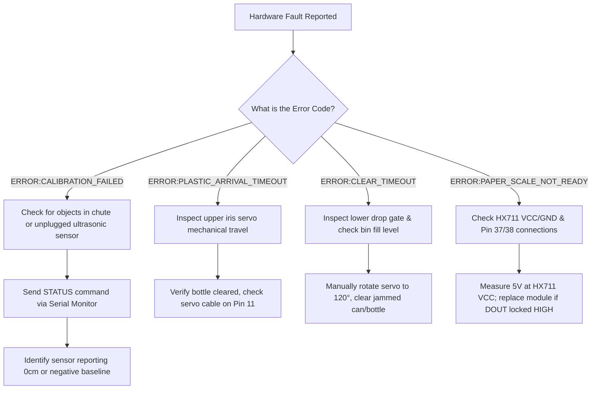

# PecoDrop Reverse Vending Machine (RVM) — Maintenance, Diagnostics & Troubleshooting Manual

> **Target Audience:** Field Support Technicians, Certified Service Contractors, Hardware Maintainers  
> **Applicable Hardware:** PecoDrop 3-Chamber Commercial Kiosk  
> **Firmware Reference:** `RVM_Arduino.ino` (Mega 2560)  

---

## 1. Preventive Maintenance Schedule

To guarantee uninterrupted public service, minimum 99.5% uptime, and zero false classifications, adhere to the scheduled service matrix below:

| Frequency | Target System | Preventive Action | Tools / Supplies |
| :--- | :--- | :--- | :--- |
| **Daily** | 3 Intake Ports | Wipe outer bezels and remove debris or residue. | Isopropyl alcohol wipe, dry microfiber |
| **Weekly** | Ultrasonic Transducers | Inspect and blow compressed air into HC-SR04 transducer grilles to eliminate dust buildup. | Clean canned compressed air (30 psi) |
| **Weekly** | Paper Load Cell Tray | Check for mechanical binding or paper scraps stuck beneath the weighing tray. Verify zero tare return. | Soft nylon brush, flashlight |
| **Monthly** | Servo Linkages & Horns | Inspect nylon/metal gear servo horns for mechanical play or slippage. Verify 10° closed and 120° open limits. | 2.0mm hex key, Phillips #1 driver |
| **Monthly** | Electrical Wiring | Check screw terminal blocks on 5V 10A buck converter and Arduino Mega screw shield. | Screwdriver, multimeter |
| **Quarterly** | Load Cell Re-calibration | Perform calibrated mass verification with a 100g test weight. Recompute `PAPER_COUNTS_PER_GRAM`. | Class M1 100g calibration weight |

---

## 2. Field Diagnostic & Fault Isolation Tree

---

## 3. Comprehensive Troubleshooting Matrix

| Diagnostic Symptom | Probable Cause | Corrective Action Procedure |
| :--- | :--- | :--- |
| **Machine outputs `ERROR:CALIBRATION_FAILED` at boot** | An item was left inside a chamber chute during power-up, or an ultrasonic sensor is disconnected. | 1. Ensure all 3 chambers are 100% empty. 2. Open serial monitor at 115200 baud and send `CALIBRATE`. 3. Review the returned `CALIBRATION:*` lines. Any reading `<= 0` indicates a disconnected or broken sensor. |
| **Chamber 1 classifies standard 500ml bottle as SMALL** | Middle ultrasonic sensor (Trig 24, Echo 41) has dust on transducer cone or is angled incorrectly. | 1. Clean sensor cone using dry compressed air. 2. Send `STATUS` command. Verify `PLASTIC_SIZE_CM` middle baseline matches chute diameter (~12cm). 3. Re-align sensor perpendicular to chute axis. |
| **Chamber 2 rejects aluminum cans (`MATERIAL:REJECT`)** | Inductive proximity sensor (Pin 32) gap is too wide (>6mm), or ground wire is loose. | 1. Check LED on back of inductive sensor. It must glow when a metal can is within 5mm. 2. Adjust threaded barrel nut to bring sensor face closer (3mm to 4mm clearance). 3. Verify Pin 32 reads `LOW` when metal touches sensor. |
| **Chamber 3 paper weight incorrect or drifts** | Mechanical binding between paper tray and side walls, or dirt under load cell. | 1. Ensure weighing tray floats freely without touching chute acrylic walls. 2. Send `CALIBRATE` command to retare baseline. 3. Place a known 100g weight on tray. Verify serial output equals ~0.100 kg. Adjust `PAPER_COUNTS_PER_GRAM = 420.0f` if necessary. |
| **Servo gate chatters, hums loudly, or restarts Arduino** | Excessive current draw or insufficient power on 5V servo bus; brownout reset. | 1. Inspect mechanical linkage for binding. 2. Measure voltage at servo power rail during movement. If voltage drops below 4.75V, adjust 10A buck converter trimpot to 5.2V. 3. Ensure separate power rail from Arduino logic. |
| **Host app reports `ERROR:CLEAR_TIMEOUT`** | An object failed to drop into the storage bin (bin full or caught on bottom flap). | 1. Empty the full bin. 2. Send `RESET` command to restore safe state. 3. Verify drop gate servo reaches full 120° rotation. |

---

## 4. Hardware Replacement & Spare Parts Catalog

| Part Designation | Manufacturer Model | Technical Specification | Source / Function |
| :--- | :--- | :--- | :--- |
| **Main Controller** | Arduino Mega 2560 Rev3 | ATmega2560 @ 16 MHz, 54 Digital I/O | Central Real-time Controller |
| **Aperture & Drop Servos** | TowerPro MG996R / MG995 | Metal Gear, High-Torque 11 kg·cm, 5V-6V | 6x Gate Motors (Pins 11, 12, 27, 28, 35, 36) |
| **Ultrasonic Sensors** | HC-SR04 | 40 kHz, 2cm to 200cm range, 5V TTL | 8x Acoustic Ranging Sensors |
| **Inductive Sensor** | LJ12A3-4-Z/BX | NPN Normally Open (NO), 6V-36V (or 5V mod) | 1x Can Purity Sensor (Pin 32) |
| **Weighing Amplifier** | Avia Semiconductor HX711 | 24-bit precision ADC, 10SPS/80SPS | 1x Strain Gauge Amplifier (Pins 37/38) |
| **Load Cell** | Micro Strain Gauge 5kg | Aluminum single-point parallel beam, 5kg max | 1x Paper Weighing Scale |
| **Servo Power Supply** | DC-DC Step Down Buck | 12V in, 5.0V-5.2V out @ 10A continuous | Dedicated Servo Power Bus |
| **Main Power Supply** | Mean Well LRS-150-12 | 12V DC, 12.5A (150W), 110V/220V AC input | Primary System Power Source |
