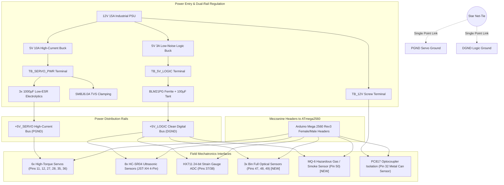
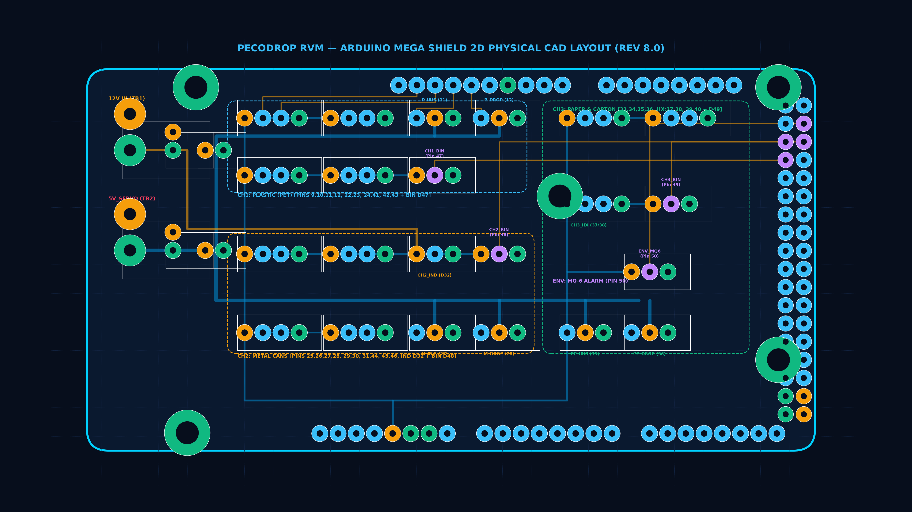
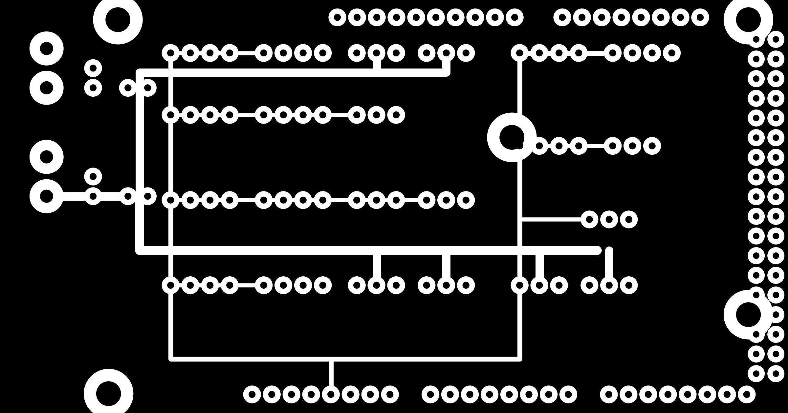
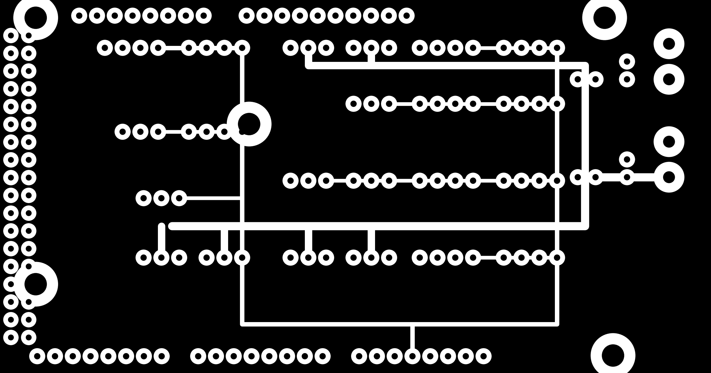
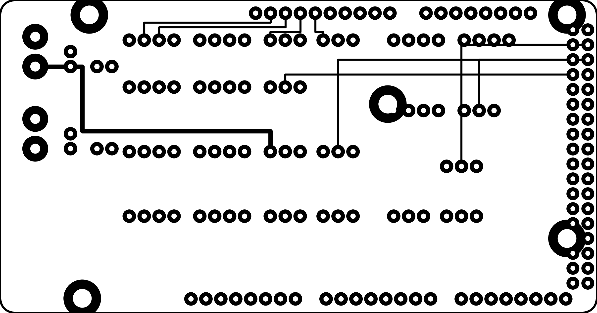
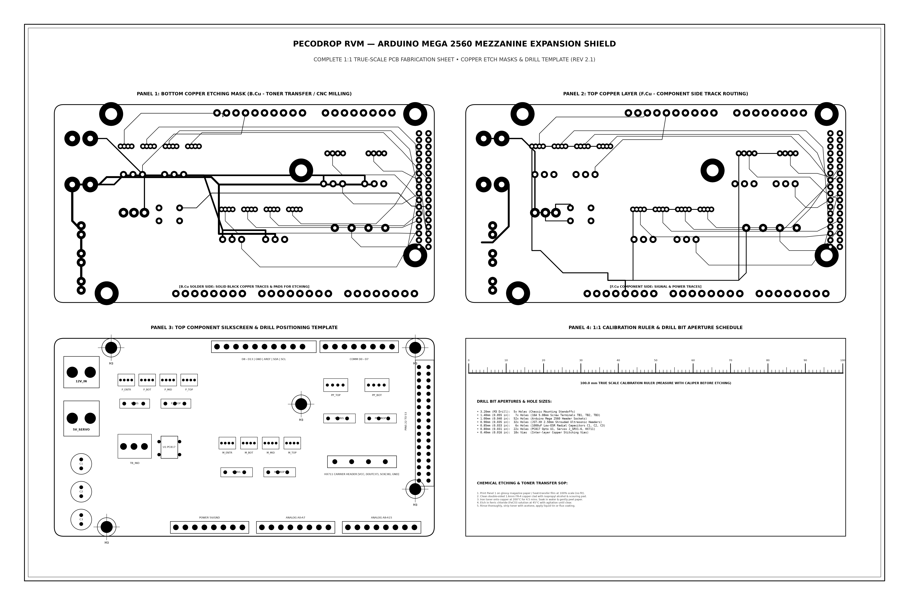

# PecoDrop Reverse Vending Machine (RVM) — Arduino Mega 2560 Mezzanine Shield PCB Design Manual

> **Document Type:** Master Hardware Engineering & Embedded Systems Specification  
> **Document Ref:** PCB-RVM-MEGA-2560-REV8.0  
> **Target Audience:** Executive / Lead Embedded Systems Engineers, Mechatronics Designers, PCB Layout Specialists  
> **Compatible Controller:** Atmel ATmega2560 (Arduino Mega 2560 Rev3) @ 16 MHz  
> **Firmware Reference:** `PecoDropDesktopApp/Arduino/RVM_Arduino/RVM_Arduino.ino`  
> **Associated Schematics & CAD:** `images/rvm_arduino_mega_shield_schematic.png` • `images/rvm_arduino_mega_shield_pcb_layout.png`  

---

## 1. Executive Summary & Problem Formulation

In early prototyping phases of industrial Reverse Vending Machines (RVMs), engineers commonly assemble sensors and actuators using standard DuPont jumper wires, mini breadboards, or generic sensor screw shields. While sufficient for lab benchtop testing, this approach causes **catastrophic reliability failures** in 24/7 public automated kiosks:

1. **Vibration-Induced Pin Dislodgement:** Continuous actuation of internal drop doors and iris servos generates mechanical vibrations that loosen friction-fit DuPont jumpers, causing intermittent sensor timeouts (`ERROR:CALIBRATION_FAILED`).
2. **Servo Back-EMF & Brownout Resets:** Six high-torque metal gear motors (TowerPro MG996R) drawing up to 2.2A stall current each inject severe inductive spikes and voltage dips onto shared power rails, triggering unintended ATmega2560 brownout watchdog resets.
3. **Inductive Ground Loops & Noise Coupling:** High-frequency PWM motor harmonics couple into the microsecond timing lines of the 8× HC-SR04 ultrasonic echo pulses and the high-impedance analog front-end of the 24-bit HX711 paper load cell.
4. **12V High-Voltage Penetration Risk:** Industrial inductive sensors (LJ12A3-4-Z/BX) require a 6V–36V operating voltage; faulty wiring or loose ground returns can expose ATmega2560 5V-tolerant GPIOs to destructive 12V potentials.

To solve these failure modes definitively, this document details the engineering design of a dedicated **Arduino Mega 2560 Mezzanine Shield PCB (Carrier Board)**. The shield mounts securely on top of the Arduino Mega 2560 Rev3 headers, providing dual-rail galvanic power isolation, optocoupled sensor conditioning, keyed polarized disconnectable connectors, and star grounding.

---

## 2. Master System Schematic & Architectural Drawing

Below is the complete engineering schematic diagram for the custom Arduino Mega 2560 Carrier Shield:


### Circuit Block Architecture:



---

## 3. Physical PCB CAD Layout & 1:1 Printable Fabrication Film

The PCB is designed strictly to the standard **Arduino Mega 2560 Rev3 form factor (101.6 mm × 53.34 mm)** with 4× M3 standoff mounting holes.

### 3.1 2D Physical CAD Composite Board Layout
Full dual-layer CAD assembly view displaying **amber top copper tracks (F.Cu)**, **cyan bottom copper tracks (B.Cu)**, golden through-hole annular pads, polarized JST-XH ultrasonic sockets, 3-pin keyed servo headers, high-current terminal blocks, decoupling capacitors, and TVS surge suppressors:



### 3.2 Bottom Copper Layer (B.Cu Solder Side) — Chemical Etch & CNC Isolation Mask
Direct view of the solder-side copper artwork. Features **solid black copper tracks**, 2.4 mm (100 mil) high-current servo power buses, 0.55 mm (22 mil) signal tracks with 45° mitered corners (no 90° acid traps), 2.0 mm outer annular pads with 0.8–1.0 mm drill centers, and an integrated **100.0 mm calibration ruler**:



### 3.3 Mirrored Bottom Copper (B.Cu Mirror) — Direct Iron-On Toner Transfer Mask
Pre-mirrored horizontally at 1:1 true scale. Print directly onto glossy photo paper or heat-transfer paper with a laser printer, then iron onto copper-clad FR-4 laminate. When flipped face down against the copper, the transferred tracks will be in the correct physical orientation:

* 📄 **Direct Ready-to-Print PDF:** [RVM_Mega_Shield_Bottom_Copper_MIRROR_1to1.pdf](RVM_Mega_Shield_Bottom_Copper_MIRROR_1to1.pdf) *(Give this file to the printer shop operator)*
* 🖼️ **Raw 300 DPI PNG Image:** [rvm_arduino_mega_shield_pcb_copper_bottom_mirror.png](images/rvm_arduino_mega_shield_pcb_copper_bottom_mirror.png)



### 3.4 Top Copper Layer (F.Cu Component Side)
Top copper routing layer for double-sided fabrication. Connects sensor trigger and PWM signal lines to the 2×18 auxiliary pin header (pins 22 to 53) and analog header without crossing power buses:



### 3.5 1:1 True Scale 4-Panel Master Fabrication & Drill Template
This master sheet is formatted for 1:1 true-scale printing on standard A4 / Letter paper or transparency film for toner-transfer PCB etching, CNC isolation routing, and manual drill verification. It contains **Panel 1: Bottom Copper Etch Mask**, **Panel 2: Top Copper Layer**, **Panel 3: Top Component Silkscreen & Drill Positioning Template**, and **Panel 4: Drill Bit Aperture Schedule & 100.0 mm Calibration Ruler**:

* 📑 **Master A4 Fabrication PDF:** [RVM_Mega_Shield_Master_Fabrication_Sheet_A4.pdf](RVM_Mega_Shield_Master_Fabrication_Sheet_A4.pdf)
* 🖼️ **Raw 300 DPI Master PNG Image:** [rvm_arduino_mega_shield_pcb_print_1to1.png](images/rvm_arduino_mega_shield_pcb_print_1to1.png)



### 3.6 Workshop Chemical Etching & Laser Toner Transfer SOP
For in-house rapid prototyping on single-sided or double-sided copper-clad FR-4:
1. **Print Mask:** Print `images/rvm_arduino_mega_shield_pcb_copper_bottom_mirror.png` on high-gloss laser photo paper at **100% Actual Size** (disable any "Fit to Printable Area" scaling).
2. **Dimension Verification:** Measure the 100.0 mm calibration bar on paper with a digital vernier caliper to confirm exact 1:1 dimensional fidelity.
3. **Copper Preparation:** Clean 1.6 mm single/double-sided FR-4 copper clad using isopropyl alcohol (IPA) and 1000-grit scouring pad until a mirror shine is achieved.
4. **Heat Transfer:** Align the mirrored print face-down onto the copper plate. Apply household iron set to 200°C (Cotton setting) with firm downward pressure for 4.5 minutes.
5. **Paper Removal:** Soak the hot board in cold water for 6 minutes until the paper dissolves, then peel gently away leaving toner tracks bonded to the copper.
6. **Chemical Etch:** Submerge in Ferric Chloride ($FeCl_3$) solution heated to 45°C with continuous agitation until exposed copper dissolves (~12–15 minutes).
7. **Drill Apertures:** Drill mounting holes (M3.2), terminal block pins (1.4mm), header pins (1.0mm), and sensor pins (0.8–0.9mm) using a precision drill press.

### Mechanical Specifications:
* **Board Dimensions:** 101.60 mm (4.000 in) × 53.34 mm (2.100 in)
* **Layer Count:** **2-Layer Standard (Top Copper F.Cu + Bottom Copper B.Cu)** — 100% routed, low cost ($2 at JLCPCB/PCBWay), and workshop etch-ready; 4-Layer optional for heavy industrial EMC installations.
* **Copper Weight:** 1 oz (35 µm) or 2 oz (70 µm) outer layers
* **Mounting Holes:** 4× M3.2 non-plated clearance holes matching Arduino Mega Rev3 chassis mounting pattern:
  * Hole 1: $(X = 14.0\,\text{mm}, Y = 2.5\,\text{mm})$
  * Hole 2: $(X = 15.2\,\text{mm}, Y = 50.8\,\text{mm})$
  * Hole 3: $(X = 66.0\,\text{mm}, Y = 35.6\,\text{mm})$
  * Hole 4: $(X = 96.5\,\text{mm}, Y = 12.7\,\text{mm})$
* **Surface Finish:** Lead-Free HASL (standard) or ENIG (Electroless Nickel Immersion Gold) for harsh recycling ambient environments.
* **Silkscreen Color:** High-contrast White on Matte Dark Blue or Matte Black Solder Mask.

---

## 4. Comprehensive Master Pinout & Netlist Table

Every pin on the Arduino Mega 2560 has an assigned, dedicated function on this shield matching firmware `RVM_Arduino.ino`:

| Mega Pin | Net Name | Hardware Connector | Connector Pinout | Direction | Logic Level | Description / Circuit Function |
| :---: | :---: | :---: | :---: | :---: | :---: | :--- |
| **D9** | `P_ENTR_TRIG` | `J_P_ENTR` (JST-XH 4P) | Pin 2 | Output | 5V TTL | Plastic entrance ultrasonic 10 µs trigger pulse |
| **D10** | `P_ENTR_ECHO` | `J_P_ENTR` (JST-XH 4P) | Pin 3 | Input | 5V TTL | Plastic entrance echo pulse with 10kΩ pull-down |
| **D11** | `P_IRIS_PWM` | `J_P_IRIS` (3-pin 0.1") | Pin 3 (SIG) | Output | 50 Hz PWM | Plastic upper iris gate servo (10° closed / 120° open) |
| **D12** | `P_DROP_PWM` | `J_P_DROP` (3-pin 0.1") | Pin 3 (SIG) | Output | 50 Hz PWM | Plastic bottom drop trapdoor servo |
| **D13** | `SYS_HEARTBEAT`| Onboard `LED_RUN` | — | Output | 5V TTL | System loop activity & firmware status indicator |
| **D8** | `FAULT_ALARM` | Testpoint / Header | — | Output | 5V TTL | Jammed gate or sensor timeout fault alarm |
| **D22** | `P_BOT_TRIG` | `J_P_BOT` (JST-XH 4P) | Pin 2 | Output | 5V TTL | Plastic sizing array — bottom sensor trigger |
| **D23** | `P_BOT_ECHO` | `J_P_BOT` (JST-XH 4P) | Pin 3 | Input | 5V TTL | Plastic sizing array — bottom sensor echo |
| **D24** | `P_MID_TRIG` | `J_P_MID` (JST-XH 4P) | Pin 2 | Output | 5V TTL | Plastic sizing array — middle sensor trigger |
| **D41** | `P_MID_ECHO` | `J_P_MID` (JST-XH 4P) | Pin 3 | Input | 5V TTL | Plastic sizing array — middle sensor echo |
| **D42** | `P_TOP_TRIG` | `J_P_TOP` (JST-XH 4P) | Pin 2 | Output | 5V TTL | Plastic sizing array — top sensor trigger |
| **D43** | `P_TOP_ECHO` | `J_P_TOP` (JST-XH 4P) | Pin 3 | Input | 5V TTL | Plastic sizing array — top sensor echo |
| **D25** | `M_ENTR_TRIG` | `J_M_ENTR` (JST-XH 4P) | Pin 2 | Output | 5V TTL | Beverage can entrance ultrasonic trigger |
| **D26** | `M_ENTR_ECHO` | `J_M_ENTR` (JST-XH 4P) | Pin 3 | Input | 5V TTL | Beverage can entrance ultrasonic echo |
| **D27** | `M_IRIS_PWM` | `J_M_IRIS` (3-pin 0.1") | Pin 3 (SIG) | Output | 50 Hz PWM | Can upper iris aperture servo |
| **D28** | `M_DROP_PWM` | `J_M_DROP` (3-pin 0.1") | Pin 3 (SIG) | Output | 50 Hz PWM | Can bottom drop discharge servo |
| **D29** | `M_BOT_TRIG` | `J_M_BOT` (JST-XH 4P) | Pin 2 | Output | 5V TTL | Can sizing array — bottom sensor trigger |
| **D30** | `M_BOT_ECHO` | `J_M_BOT` (JST-XH 4P) | Pin 3 | Input | 5V TTL | Can sizing array — bottom sensor echo |
| **D31** | `M_MID_TRIG` | `J_M_MID` (JST-XH 4P) | Pin 2 | Output | 5V TTL | Can sizing array — middle sensor trigger |
| **D44** | `M_MID_ECHO` | `J_M_MID` (JST-XH 4P) | Pin 3 | Input | 5V TTL | Can sizing array — middle sensor echo |
| **D45** | `M_TOP_TRIG` | `J_M_TOP` (JST-XH 4P) | Pin 2 | Output | 5V TTL | Can sizing array — top sensor trigger |
| **D46** | `M_TOP_ECHO` | `J_M_TOP` (JST-XH 4P) | Pin 3 | Input | 5V TTL | Can sizing array — top sensor echo |
| **D32** | `CAN_INDUCTIVE`| Optocoupler `U1` | Collector | Input | 5V TTL | Inductive proximity trigger (`INPUT_PULLUP`, Active LOW) |
| **D33** | `PP_ENTR_TRIG`| `J_PP_ENTR` (JST-XH 4P)| Pin 2 | Output | 5V TTL | Paper intake top ultrasonic trigger |
| **D34** | `PP_ENTR_ECHO`| `J_PP_ENTR` (JST-XH 4P)| Pin 3 | Input | 5V TTL | Paper intake top ultrasonic echo |
| **D35** | `PP_IRIS_PWM` | `J_PP_IRIS` (3-pin 0.1")| Pin 3 (SIG) | Output | 50 Hz PWM | Paper upper intake flap servo |
| **D36** | `PP_DROP_PWM` | `J_PP_DROP` (3-pin 0.1")| Pin 3 (SIG) | Output | 50 Hz PWM | Paper bottom dump gate servo |
| **D37** | `HX711_DOUT` | `J_HX711` (4-pin 0.1") | Pin 2 | Input | 5V TTL | 24-bit ADC Serial Data Output (Tare & Mass) |
| **D38** | `HX711_SCK` | `J_HX711` (4-pin 0.1") | Pin 3 | Output | 5V TTL | 24-bit ADC Serial Clock Output (Bit-banged) |
| **D39** | `PP_BOT_TRIG` | `J_PP_BOT` (JST-XH 4P) | Pin 2 | Output | 5V TTL | Paper tray arrival confirmation trigger |
| **D40** | `PP_BOT_ECHO` | `J_PP_BOT` (JST-XH 4P) | Pin 3 | Input | 5V TTL | Paper tray arrival confirmation echo |
| **D47** | `P_BIN_FULL` | `J_P_BIN` (JST-XH 3P) | Pin 2 (SIG) | Input | 5V TTL | Plastic bin optical full sensor (`INPUT_PULLUP`, Active LOW = Full) [NEW] |
| **D48** | `M_BIN_FULL` | `J_M_BIN` (JST-XH 3P) | Pin 2 (SIG) | Input | 5V TTL | Metal bin optical full sensor (`INPUT_PULLUP`, Active LOW = Full) [NEW] |
| **D49** | `PP_BIN_FULL` | `J_PP_BIN` (JST-XH 3P) | Pin 2 (SIG) | Input | 5V TTL | Paper bin optical full sensor (`INPUT_PULLUP`, Active LOW = Full) [NEW] |
| **D50** | `MQ6_GAS_ALARM`| `J_MQ6` (JST-XH 3P) | Pin 2 (SIG) | Input | 5V TTL | MQ-6 Hazardous Gas / Smoke Alarm (`INPUT_PULLUP`, Active LOW = Alarm) [NEW] |
| **D20** | `I2C_SDA` | `J_I2C` Header | Pin 3 | Bidirectional | 5V TTL | Auxiliary I2C Serial Data (Optional OLED / Sensors) |
| **D21** | `I2C_SCL` | `J_I2C` Header | Pin 4 | Output | 5V TTL | Auxiliary I2C Serial Clock |
| **RESET**| `MCU_RESET` | `SW_RESET` Pushbutton | Pin 1 | Input | Active LOW | Hardware manual restart tactile switch |

---

## 5. Critical Sub-Circuit Engineering Details

### 5.1 Dual-Rail Power Distribution & Thermal Sizing

```
                   +-------------------------------------------------------+
                   |  MAIN 12V 15A INDUSTRIAL POWER SUPPLY (Mean Well)     |
                   +-------------------------------------------------------+
                                  |                         |
               +-----------------------------+   +-----------------------------+
               | 5V 10A BUCK REGULATOR       |   | 5V 3A LOGIC BUCK REGULATOR  |
               | (Dedicated Servo Rail)      |   | (Clean Controller Rail)     |
               +-----------------------------+   +-----------------------------+
                                  |                         |
                         TB_SERVO_PWR (5.08mm)     TB_5V_LOGIC (5.08mm)
                                  |                         |
                 +----------------+----------------+        | [Ferrite Bead BLM21PG]
                 | 3x 1000µF Low-ESR Bulk Caps    |        | + 100µF Tantalum Bulk
                 | 1x SMBJ6.0A TVS Clamping Diode |        | + 100nF per Sensor Header
                 +----------------+----------------+        |
                                  |                         |
                    +5V_SERVO Power Plane             +5V_LOGIC Plane
                   (All 6 Servos: 15A Peak)          (Mega + Ultrasonics + HX711)
                                  |                         |
                                PGND                      DGND
                                  \                         /
                                   \                       /
                                    \                     /
                                     [STAR NET-TIE 0Ω]
```

* **Trace Width Sizing (IPC-2152 Compliance):**
  * Current: $10\,\text{A}$ continuous, $15\,\text{A}$ peak.
  * Copper Weight: $2\,\text{oz}$ ($70\,\mu\text{m}$).
  * Allowable Temperature Rise: $\Delta T = 20^\circ\text{C}$.
  * **Required Power Trace Width:** Minimum $5.5\,\text{mm}$ ($220\,\text{mil}$) on outer layers, or dedicated internal power copper polygon pour (recommended).
* **Back-EMF Transient Suppression:**
  * When high-torque MG996R motors brake or reverse under mechanical gate loads, flyback voltage surges can exceed $12\,\text{V}$ on a $5\,\text{V}$ line.
  * The shield features an onboard **SMBJ6.0A unidirectional Transient Voltage Suppressor (TVS)** diode with a breakdown voltage of $6.67\,\text{V}$ and peak pulse power handling of $600\,\text{W}$.
  * Three parallel **$1000\,\mu\text{F} / 16\,\text{V}$ ultra-low ESR ($< 25\,\text{m}\Omega$) aluminum electrolytic capacitors** ($C_1, C_2, C_3$) provide instantaneous charge reservoirs during simultaneous gate rotation.

---

### 5.2 Optocoupled Industrial 12V Inductive Sensor Conditioning

Standard inductive proximity sensors (e.g., LJ12A3-4-Z/BX) utilize internal open-collector NPN switching transistors. Running these directly into 5V microcontrollers using passive resistor dividers risks catastrophic damage if the ground path lifts or the 12V supply shorts.

The shield isolates the inductive input using an **Everlight EL817 / Sharp PC817 optocoupler**:

```
 +12V_RAW (TB_IND Pin 1) ------------------------+
                                                 |
                                         [Sensor VCC Wire: Brown]
                                                 |
                                         LJ12A3-4-Z/BX Proximity Sensor
                                                 |
                                         [Sensor NPN Out: Black]
                                                 |
 +12V_RAW ----[ 2.2kΩ 0.5W ]----> [Anode U1]     |
                                                 |
                                  [Cathode U1]---+---[ 1N4148 Diode ]---> GND_IND
                                                 |
                                                 | (When metal detected, NPN conducts
                                                 |  drawing current through opto LED)
 -------------------------------------------------------------------------------------
 [GALVANIC ISOLATION BARRIER: 5000 VRMS Isolation]
 -------------------------------------------------------------------------------------
 +5V_LOGIC 
     |
  [10kΩ Pull-up / Internal ATmega Pull-up]
     |
     +-------> Arduino Mega Pin 32 (CAN_INDUCTIVE)
     |
  [Collector U1: PC817 Phototransistor]
  [Emitter U1] ----> DGND (Logic Ground)
```

* **Operating Mode:**
  * No Metal Detected: Optocoupler LED is OFF; Phototransistor is OFF; Pin 32 reads `HIGH` ($5.0\,\text{V}$).
  * Metal Can Detected: Sensor pulls output to Ground; current flows through optocoupler LED; Phototransistor saturates, clamping Pin 32 to `LOW` ($0.15\,\text{V}$).
  * Reverse Voltage Protection: $1\text{N}4148$ diode clamps reverse inductive ringing.

---

### 5.3 High-Stability HX711 Load Cell Analog Front-End Filtering

The HX711 24-bit Sigma-Delta ADC is extremely sensitive to power rail ripple. Switching noise on the 5V rail can introduce $\pm 50\,\text{g}$ mass oscillations.

To achieve reliable $\pm 1.0\,\text{g}$ mass resolution:
1. The HX711 power pin receives filtered analog power (`5V_ANA`) fed through a **$\Pi$-filter ($10\,\Omega$ series resistor $+ 10\,\mu\text{F}$ low-ESR tantalum capacitor $+ 100\,\text{nF}$ ceramic)**.
2. The strain gauge differential signals ($E+, E-, A+, A-$) are routed with length-matched differential pairs away from high-current servo PWM signals.
3. SCK line (Pin 38) and DOUT line (Pin 37) feature $100\,\Omega$ series damping resistors to eliminate clock reflection ringing.

---

## 6. Comprehensive Bill of Materials (BOM)

All components are standard industrial parts readily available from LCSC, DigiKey, Mouser, and JLCPCB SMT assembly service:

| Reference | Qty | Description | Package / Footprint | Manufacturer Part Number (MPN) | LCSC Part # | Function / Notes |
| :---: | :---: | :--- | :--- | :--- | :--- | :--- |
| **U1** | 1 | Optocoupler Phototransistor 5kV | DIP-4 / SOP-4 | Everlight EL817C | C4998 | Inductive sensor galvanic isolation |
| **D1** | 1 | TVS Diode 6.0V 600W Unidirectional | DO-214AA (SMB) | Littelfuse SMBJ6.0A | C2832814 | Servo power rail transient suppression |
| **D2, D3** | 2 | Fast Switching Diode 100V 300mA | SOD-123 | 1N4148W | C81598 | Flyback & reverse polarity clamp |
| **C1, C2, C3**| 3 | Aluminum Electrolytic Cap 1000µF 16V Low-ESR | Radial $\phi 10\times 16\,\text{mm}$ | Panasonic EEU-FR1C102 | C137837 | Bulk servo current transient reservoir |
| **C4** | 1 | Tantalum Cap 100µF 16V 10% | Case D (7343-31) | AVX TAJD107K016RNJ | C7171 | Logic rail low-frequency decoupling |
| **C5–C18** | 14 | MLCC Ceramic Cap 100nF (0.1µF) 50V X7R | 0805 SMD | Murata GRM21BR71H104KA01L | C49678 | Decoupling cap for each connector |
| **FB1** | 1 | Ferrite Bead 600Ω @ 100MHz 3A | 0805 SMD | Murata BLM21PG601SN1D | C23177 | Logic rail high-frequency RF filter |
| **R1** | 1 | Thick Film Resistor 2.2kΩ 0.5W 1% | 1206 SMD | Yageo RC1206FR-072K2L | C4460 | Optocoupler LED current limit |
| **R2, R3, R4**| 3 | Thick Film Resistor 330Ω 0.25W 1% | 0805 SMD | Uniroyal 0805W8F3300T5E | C17630 | LED current limit resistors |
| **R5, R6** | 2 | Thick Film Resistor 100Ω 0.125W 1% | 0805 SMD | Uniroyal 0805W8F1000T5E | C17414 | HX711 clock/data series damping |
| **R7** | 1 | Thick Film Resistor 10kΩ 0.125W 1% | 0805 SMD | Uniroyal 0805W8F1002T5E | C17415 | Optocoupler collector pull-up |
| **LED1** | 1 | SMD LED Green (565nm) 20mA | 0805 SMD | Everlight 17-215SURC/S530-A3/TR8 | C84267 | `LED_PWR_LOGIC` (5V MCU Status) |
| **LED2** | 1 | SMD LED Blue (470nm) 20mA | 0805 SMD | Everlight 19-217/BHC-AP1Q2/3T | C72043 | `LED_PWR_SERVO` (5V Servo Status) |
| **LED3** | 1 | SMD LED Amber (590nm) 20mA | 0805 SMD | Everlight 19-217/Y5C-AP1Q2/3T | C72044 | `LED_HEARTBEAT` (Pin 13 Activity) |
| **SW1** | 1 | Tactile Pushbutton Switch SPST 6x6mm | SMD / Through-hole | Omron B3F-1000 | C115357 | `SW_RESET` Hardware MCU reset |
| **TB1, TB2** | 2 | Screw Terminal Block 2-Pin 5.08mm Pitch 16A | Through-hole 5.08mm | Cixi Degson DG128-5.08-02P | C406450 | `TB_12V` and `TB_SERVO_PWR` Inputs |
| **TB3** | 1 | Screw Terminal Block 3-Pin 5.08mm Pitch 16A | Through-hole 5.08mm | Cixi Degson DG128-5.08-03P | C406451 | `TB_INDUCTIVE` Proximity Sensor Input |
| **J_SRV1–6** | 6 | Polarized Pin Header 1x3 2.54mm Keyed | 2.54mm Pitch Through-hole | Wurth Elektronik 61300311121 | C2897384 | 6x Gate Servo Connectors [G, V, S] |
| **J_US1–8** | 8 | JST-XH Shrouded Header 4-Pin 2.50mm | 2.50mm Pitch Male Right Angle | JST B4B-XH-A | C157934 | 8x Ultrasonic HC-SR04 Ports |
| **J_HX** | 1 | Pin Header Socket 1x4 2.54mm Gold-Plated | 2.54mm Pitch Female Socket | Amphenol 68000-104HLF | C124376 | HX711 Breakout Module Carrier Socket |
| **HDR_MEGA** | 1 | Arduino Mega Long-Lead Shield Header Kit | Mixed (1x10, 1x8, 2x18) | Adafruit / SparkFun PRT-09372 | — | Bottom-mating stackable pins to Mega |

---

## 7. PCB Layer Stackups: Standard 2-Layer vs. Optional 4-Layer

### 7.1 Standard 2-Layer Stackup (Default & Artwork Matched)
The artwork provided in this repository is designed natively as a **2-layer PCB** (standard 1.6 mm FR-4). This is the most practical and cost-effective approach ($2 for 5 boards at JLCPCB/PCBWay, or achievable with double-sided/single-sided workshop toner-transfer etching):

```
┌─────────────────────────────────────────────────────────────┐
│ Layer 1: Top Copper (F.Cu)                                  │
│ ├── Component solder pads & JST headers                     │
│ ├── Top-side signal jumper tracks to pins 22–53             │
│ └── Clean +5V_LOGIC local distribution & bypass caps        │
├─────────────────────────────────────────────────────────────┤
│ Core: 1.6mm FR-4 Dielectric (TG140–150)                     │
├─────────────────────────────────────────────────────────────┤
│ Layer 2: Bottom Copper (B.Cu)                               │
│ ├── 2.4 mm (100 mil) High-Current +5V_SERVO Power Bus       │
│ ├── Master PGND (Motor Return) & DGND Star Grounds          │
│ ├── Arduino Mega 2560 male stacking pin headers             │
│ └── 45° mitered signal lines & annular solder rings         │
└─────────────────────────────────────────────────────────────┘
```

> [!TIP]
> **Single-Sided (1-Layer) DIY Etch Workaround:** If you only have single-sided copper clad in your workshop, etch only **Layer 2 (B.Cu)** using `rvm_arduino_mega_shield_pcb_copper_bottom_mirror.png`. The few traces on Layer 1 can easily be replaced by 4 standard 24 AWG insulated jumper wires on the top side.

### 7.2 Optional 4-Layer Stackup (For Harsh Industrial EMC Environments)
For mass-produced commercial kiosks deployed in electrically noisy environments with nearby AC compressors, billing coin hoppers, and heavy industrial machinery, the CAD files can optionally be exported as a 4-layer stackup with dedicated internal ground and power planes:

```
Layer 1 (Top Signal & Components): 
├── High-speed digital signals (Echo / Trig / I2C / SPI)
├── Component pads, decoupling caps, JST headers
└── Local ground floods connected to Layer 2 via stitched vias

Layer 2 (Ground Plane):
├── Continuous solid ground copper plane
├── Split strictly into DGND (Digital) and PGND (Power) regions
└── Single point bridge (0Ω net-tie) directly beneath the power entrance

Layer 3 (Power Planes):
├── Split polygon copper pours:
│   ├── +5V_SERVO Zone (Width > 20mm, 2 oz copper)
│   ├── +5V_LOGIC Zone
│   └── +12V_RAW Zone
└── Decoupling capacitor return vias drop directly into Layer 2/3

Layer 4 (Bottom Signal & Mega Mating Pins):
├── Arduino Mega 2560 male stacking pin headers
├── Non-critical low-speed routing
└── Full ground fill stitched with 10mm via grid
```

### Routing Rules for Master Embedded Systems:
1. **Ultrasonic Echo Lines:** HC-SR04 echo pulse duration determines container size down to millimeters ($58\,\mu\text{s}/\text{cm}$). Echo traces must not run parallel to 50 Hz PWM servo lines. Maintain a minimum $3W$ trace clearance ($> 0.8\,\text{mm}$) between PWM and Echo traces.
2. **Servo Return Currents:** Return currents from the 6 MG996R motors must flow directly into `TB_SERVO_PWR` through `PGND` without traversing the `DGND` digital ground plane under the ATmega2560 or HX711 chip.
3. **Stitching Vias:** Place ground stitching vias within $2\,\text{mm}$ of every decoupling capacitor pad to minimize parasitic loop inductance.

---

## 8. Assembly, Quality Control & Field Commissioning SOP

Before mounting the shield onto the Arduino Mega 2560 and connecting power, the technician must execute the following step-by-step verification checklist:

### Step 1: Unpowered Cold Impedance & Short-Circuit Check
1. Set digital multimeter (DMM) to **Continuity / Diode Test**.
2. Probe between `+5V_SERVO` and `PGND` on `TB_SERVO_PWR`. Ensure resistance climbs above $10\,\text{k}\Omega$ as bulk caps charge. A reading near $0\,\Omega$ indicates a shorted TVS diode or reversed electrolytic capacitor.
3. Probe between `+5V_LOGIC` and `DGND`. Ensure resistance $> 5\,\text{k}\Omega$.
4. Probe between `PGND` and `DGND`. Multimeter should beep only through the star-point zero-ohm jumper ($R < 0.2\,\Omega$).

### Step 2: Bench Power-On Voltage Validation (Shield Disconnected from Mega)
1. Connect $12\,\text{V}$ from bench power supply to `TB_12V`.
2. Connect $5.1\,\text{V}$ from $10\,\text{A}$ buck regulator to `TB_SERVO_PWR`.
3. Connect $5.0\,\text{V}$ from $3\,\text{A}$ buck regulator to `TB_5V_LOGIC`.
4. Measure voltages at onboard testpoints:
   * `TP_5V_SERVO`: Verify $5.05\,\text{V}$ to $5.20\,\text{V}$. Blue LED must illuminate.
   * `TP_5V_LOGIC`: Verify $4.95\,\text{V}$ to $5.05\,\text{V}$. Green LED must illuminate.
   * `TP_IND_12V`: Verify $12.0\,\text{V} \pm 0.3\,\text{V}$.
5. Test Optocoupler Action: Momentarily ground the `TB_INDUCTIVE` SIG pin with a jumper wire. Amber `D2:IND` LED must glow, and voltage at testpoint `TP_IND_SIG` must drop from $5.0\,\text{V}$ to $< 0.2\,\text{V}$.

### Step 3: Mating with Arduino Mega 2560 & Kiosk Integration
1. Power off all supplies. Align shield male header pins with Arduino Mega female headers. Press downward firmly and evenly until fully seated.
2. Secure the 4× M3 hex standoffs with nylon washers.
3. Plug in the 8× JST-XH ultrasonic cables, 6× servo cables, inductive sensor screw terminal, and HX711 header.
4. Connect the USB cable between the Arduino Mega and the Kiosk PC running `PecoDropDesktopApp`.
5. Power up the system. Send serial command `CALIBRATE` via desktop terminal or admin diagnostic tool. Verify all 8 ultrasonic sensors return clean empty distances ($\sim 12\,\text{cm}$ to $120\,\text{cm}$) and that the HX711 scales tare to `0.0g`.

---

## 9. Fabrication & Gerber Export Settings

For automated manufacturing via JLCPCB, PCBWay, or Eurocircuits:

* **Gerber Format:** RS-274X (2:5 mm resolution)
* **Drill Format:** Excellon format, Metric unit, trailing zeros suppressed
* **Minimum Track Width / Spacing:** $0.15\,\text{mm} / 0.15\,\text{mm}$ ($6\,\text{mil} / 6\,\text{mil}$)
* **Minimum Via Hole Size / Diameter:** $0.3\,\text{mm} / 0.6\,\text{mm}$
* **Solder Mask Clearance:** $+0.05\,\text{mm}$
* **Silkscreen Min Line Width:** $0.15\,\text{mm}$ (height $\ge 1.0\,\text{mm}$)
* **IPC Class:** IPC-A-600 Class 2 (Dedicated Industrial Electronic Products)
