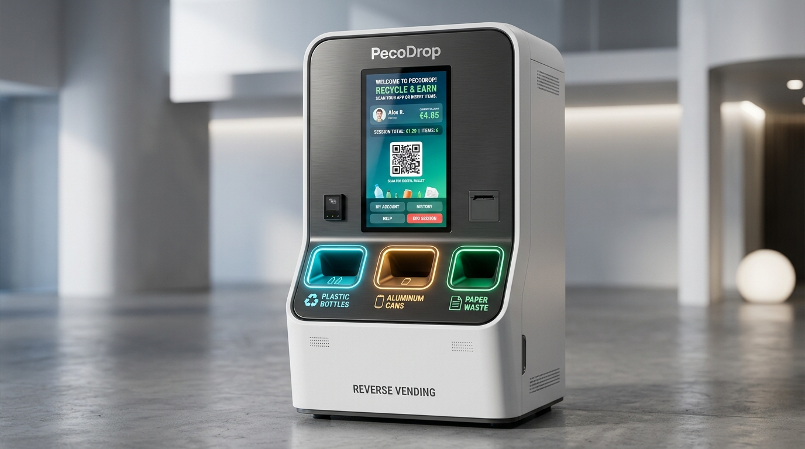

# PecoDrop RVM — Master User Manuals & Technical Documentation Suite

Welcome to the **PecoDrop 3-Chamber Smart Reverse Vending Machine (RVM)** master documentation suite. This documentation covers end-user recycling operation, mechatronics hardware assembly, Arduino Mega 2560 firmware architecture, serial telemetry protocols, and preventive maintenance.

---

## 📚 Document Navigation

| Document | File Link | Target Audience | Key Contents |
| :--- | :--- | :--- | :--- |
| **Interactive Portal** | [index.html](index.html) | All Users & Engineers | Web portal with lightbox diagrams, pinout search, and printable view. |
| **01. Operator Manual** | [01_OPERATOR_USER_MANUAL.md](01_OPERATOR_USER_MANUAL.md) | End-Users & Attendants | 4-step deposit guide, accepted vs. rejected items, bilingual prompts (Urdu & English), daily checklist. |
| **02. Hardware Engineering** | [02_HARDWARE_ENGINEERING_MANUAL.md](02_HARDWARE_ENGINEERING_MANUAL.md) | Hardware Engineers & Technicians | Complete Mega 2560 pinout table, 5V/12V power rails, servo mechanical travel, sensor placement. |
| **03. Firmware & Serial API** | [03_FIRMWARE_AND_SERIAL_API_MANUAL.md](03_FIRMWARE_AND_SERIAL_API_MANUAL.md) | Software Developers & Integrators | 115200 baud serial protocol, state machine, command dictionary, regex telemetry schema, C# code. |
| **04. Maintenance & Diagnostics** | [04_MAINTENANCE_AND_TROUBLESHOOTING_MANUAL.md](04_MAINTENANCE_AND_TROUBLESHOOTING_MANUAL.md) | Field Support Contractors | Preventive maintenance schedule, error code troubleshooting tree, spare parts catalog. |
| **05. Mega Shield PCB Design** | [05_ARDUINO_MEGA_SHIELD_PCB_DESIGN.md](05_ARDUINO_MEGA_SHIELD_PCB_DESIGN.md) | Executive Embedded & PCB Designers | Master Schematic, PCB 2D layout, 1:1 printable film, dual-rail power isolation, TVS flyback clamp, PC817 optocoupler, BOM, JLCPCB/PCBWay fabrication. |
| **⚡ CAD Interactive Suite** | [RVM_Arduino_Mega_Shield_Design_Guide.html](RVM_Arduino_Mega_Shield_Design_Guide.html) | Mechatronics & Production Engineers | Interactive CAD viewer (Print film, 2D layout, schematic), zoomable viewer, dynamic current calculator, searchable pin netlist. |
| **📦 Production BOM (CSV)** | [rvm_mega_shield_bom.csv](rvm_mega_shield_bom.csv) | Procurement & SMT Assembly | Complete 28-line Bill of Materials with MPNs and LCSC part codes for automated pick-and-place. |

---

## 🖼️ High-Resolution Technical Diagram Gallery (`images/`)

All diagrams are provided in ultra-high resolution (300 DPI PNG format) in the `images/` directory:

1. [`rvm_kiosk_system_overview.png`](images/rvm_kiosk_system_overview.png): 3D CAD Master Rendering of Kiosk, Touchscreen & 3 Illuminated Intake Ports.
2. [`operator_kiosk_touchscreen_guide.png`](images/operator_kiosk_touchscreen_guide.png): 4-Card Customer Recycling & Mobile App QR Code Reward Claim Workflow.
3. [`chamber1_plastic_sizing_flow.png`](images/chamber1_plastic_sizing_flow.png): Chamber 1 PET Bottle Sizing Tower, 3-Tier Ultrasonic Array & Sizing Truth Table.
4. [`chamber2_metal_inductive_flow.png`](images/chamber2_metal_inductive_flow.png): Chamber 2 Beverage Can Intake, Inductive Proximity Sampling & Rejection Logic.
5. [`chamber3_paper_loadcell_flow.png`](images/chamber3_paper_loadcell_flow.png): Chamber 3 Paper Wastage Chute, HX711 24-Bit ADC Load Cell & Dynamic Tare Calibration.
6. [`rvm_arduino_mega_pinout_wiring.png`](images/rvm_arduino_mega_pinout_wiring.png): Complete Arduino Mega 2560 Pinout Schematic & Dual-Rail Isolated Power Distribution.
7. [`rvm_state_machine_serial_protocol.png`](images/rvm_state_machine_serial_protocol.png): Firmware Finite State Machine, Asynchronous Serial Commands & Telemetry Handshake.
8. [`rvm_arduino_mega_shield_pcb_copper_bottom.png`](images/rvm_arduino_mega_shield_pcb_copper_bottom.png): Bottom Copper Layer (B.Cu Solder Side) — Chemical Etching & CNC Isolation Routing Mask.
9. [`rvm_arduino_mega_shield_pcb_copper_bottom_mirror.png`](images/rvm_arduino_mega_shield_pcb_copper_bottom_mirror.png): Mirrored Bottom Copper (B.Cu Mirror) — Laser Printer Direct Iron-On Toner Transfer Mask.
10. [`rvm_arduino_mega_shield_pcb_copper_top.png`](images/rvm_arduino_mega_shield_pcb_copper_top.png): Top Copper Layer (F.Cu Component Side) — Top Signal Routing Mask.
11. [`rvm_arduino_mega_shield_pcb_print_1to1.png`](images/rvm_arduino_mega_shield_pcb_print_1to1.png): 1:1 Scale 4-Panel Master Printable PCB Film & Drill Sheet (A4 sheet with 100.0 mm calibration ruler).
12. [`rvm_arduino_mega_shield_pcb_layout.png`](images/rvm_arduino_mega_shield_pcb_layout.png): Physical 2D CAD PCB Layout & Composite View with Amber & Cyan Copper Tracks.
13. [`rvm_arduino_mega_shield_schematic.png`](images/rvm_arduino_mega_shield_schematic.png): Master Arduino Mega 2560 Expansion Shield Schematic (Dual Rails, TVS Protection, Optocoupler Stage).

---

## ⚡ Quick Technical Specs Summary

* **Microcontroller:** Arduino Mega 2560 (ATmega2560 @ 16 MHz)
* **Serial Protocol:** 115200 baud, 8-N-1, CRLF line termination (`\n` or `\r\n`)
* **Chamber 1 (Plastic):** 4x HC-SR04 ultrasonic sensors (Entrance: Pins 9/10, Sizing: Pins 22/23, 24/41, 42/43), 2x MG996R servos (Iris: Pin 11, Drop: Pin 12)
* **Chamber 2 (Metal):** 4x HC-SR04 sensors (Entrance: Pins 25/26, Sizing: Pins 29/30, 31/44, 45/46), 1x Inductive sensor (Pin 32), 2x MG996R servos (Iris: Pin 27, Drop: Pin 28)
* **Chamber 3 (Paper):** 2x HC-SR04 sensors (Top: Pins 33/34, Bottom: Pins 39/40), 1x HX711 Load Cell (DOUT: Pin 37, SCK: Pin 38), 2x MG996R servos (Iris: Pin 35, Drop: Pin 36)
* **Primary Power Supply:** 12V 15A Industrial DC PSU; Step-down to 5V 10A (Servos) and 5V 3A (Logic & Sensors) with common star ground.
